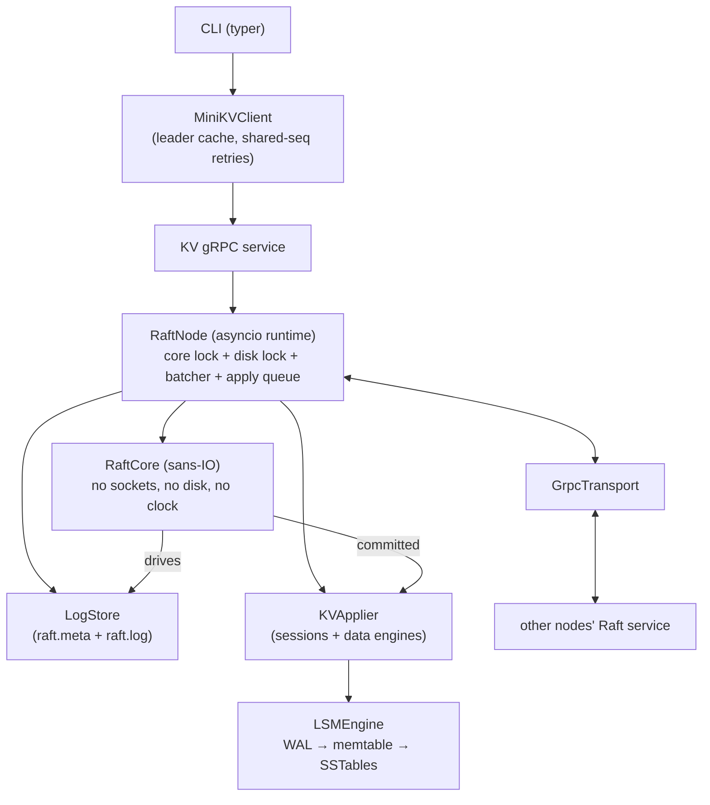
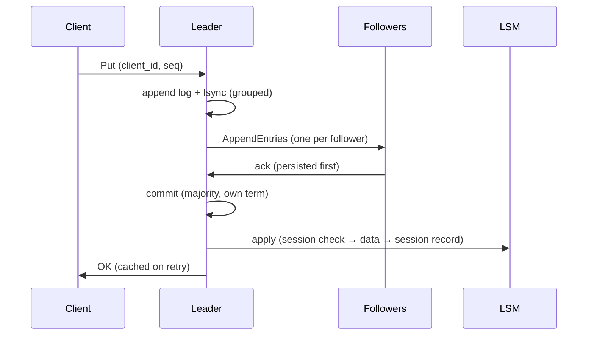
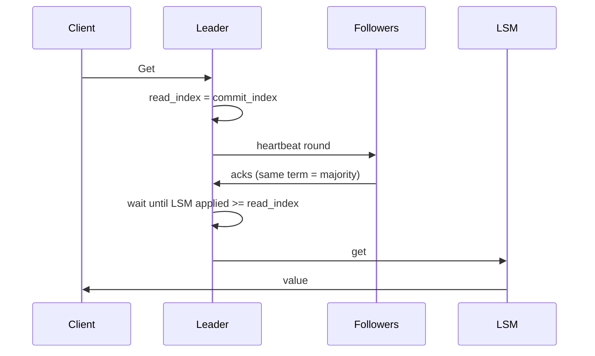
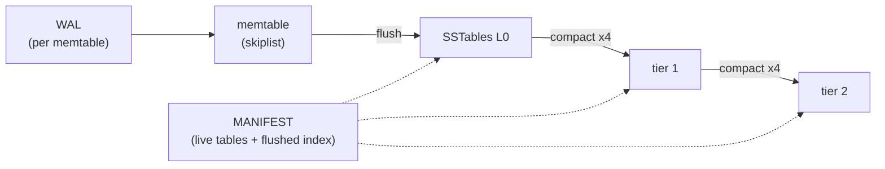
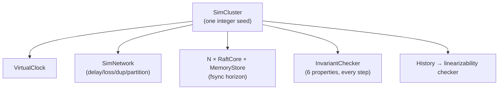

# architecture.md

## Components

```mermaid
flowchart TD
  CLI["CLI (typer)"] --> Client["MiniKVClient<br/>(leader cache, shared-seq retries)"]
  Client --> KV["KV gRPC service"]
  KV --> Node["RaftNode (asyncio runtime)<br/>core lock + disk lock + batcher + apply queue"]
  Node --> Core["RaftCore (sans-IO)<br/>no sockets, no disk, no clock"]
  Node --> Store["LogStore<br/>(raft.meta + raft.log)"]
  Node --> Applier["KVApplier<br/>(sessions + data engines)"]
  Applier --> LSM["LSMEngine<br/>WAL → memtable → SSTables"]
  Node <--> Transport["GrpcTransport"]
  Transport <--> Peers["other nodes' Raft service"]
  Core -->|drives| Store
  Core -->|committed| Applier
```

## Write path

```mermaid
sequenceDiagram
  participant C as Client
  participant L as Leader
  participant F as Followers
  participant S as LSM
  C->>L: Put (client_id, seq)
  L->>L: append log + fsync (grouped)
  L->>F: AppendEntries (one per follower)
  F->>L: ack (persisted first)
  L->>L: commit (majority, own term)
  L->>S: apply (session check → data → session record)
  L->>C: OK (cached on retry)
```

## Linearizable read path (ReadIndex)

```mermaid
sequenceDiagram
  participant C as Client
  participant L as Leader
  participant F as Followers
  participant S as LSM
  C->>L: Get
  L->>L: read_index = commit_index
  L->>F: heartbeat round
  F->>L: acks (same term = majority)
  L->>L: wait until LSM applied >= read_index
  L->>S: get
  S->>C: value
```

## Storage layout

```mermaid
flowchart LR
  WAL["WAL<br/>(per memtable)"] --> MEM["memtable<br/>(skiplist)"]
  MEM -->|flush| SST["SSTables L0"]
  SST -->|compact x4| T1["tier 1"]
  T1 -->|compact x4| T2["tier 2"]
  MAN["MANIFEST<br/>(live tables + flushed index)"] -.-> SST
  MAN -.-> T1
  MAN -.-> T2
```

## Simulator

```mermaid
flowchart TD
  Harness["SimCluster<br/>(one integer seed)"] --> Clock["VirtualClock"]
  Harness --> Net["SimNetwork<br/>(delay/loss/dup/partition)"]
  Harness --> Cores["N × RaftCore + MemoryStore<br/>(fsync horizon)"]
  Harness --> Check["InvariantChecker<br/>(6 properties, every step)"]
  Harness --> Hist["History → linearizability checker"]
```
