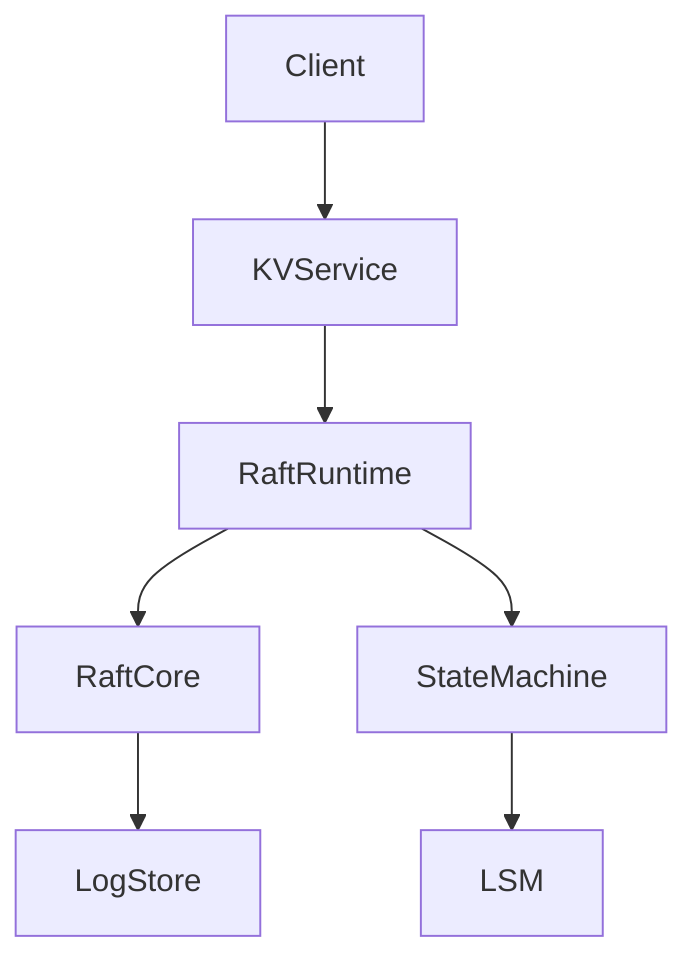

# architecture.md (placeholder, diagrams in M9)

```mermaid
flowchart TD
  Client --> KVService
  KVService --> RaftRuntime
  RaftRuntime --> RaftCore
  RaftCore --> LogStore
  RaftRuntime --> StateMachine
  StateMachine --> LSM
```
